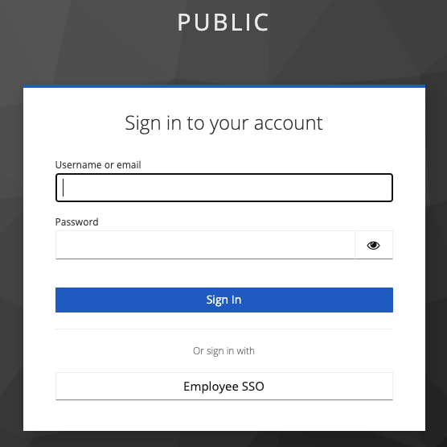

This repository contains a preconfigured keycloak instance with two realms:

- `private`
- `public`

The public realm uses the private realm as an oidc provider. Employees (who "live" on the private realm) can login to the application via the "Employee SSO" (see screenshot below). External customers live on a separate, public realm and can directly login with username/password.

# Getting Started

- `docker-compose -f docker/docker-compose.yml up -d`
- `cd client && yarn dev`

# Credentials

## Public Realm

- username: `customer_a`
- password: `password`

## Private Realm

- username: `employee_a`
- password: `password`

## Keycloak Admin

http://localhost:8081/admin

- username: `admin`
- password: `admin`
